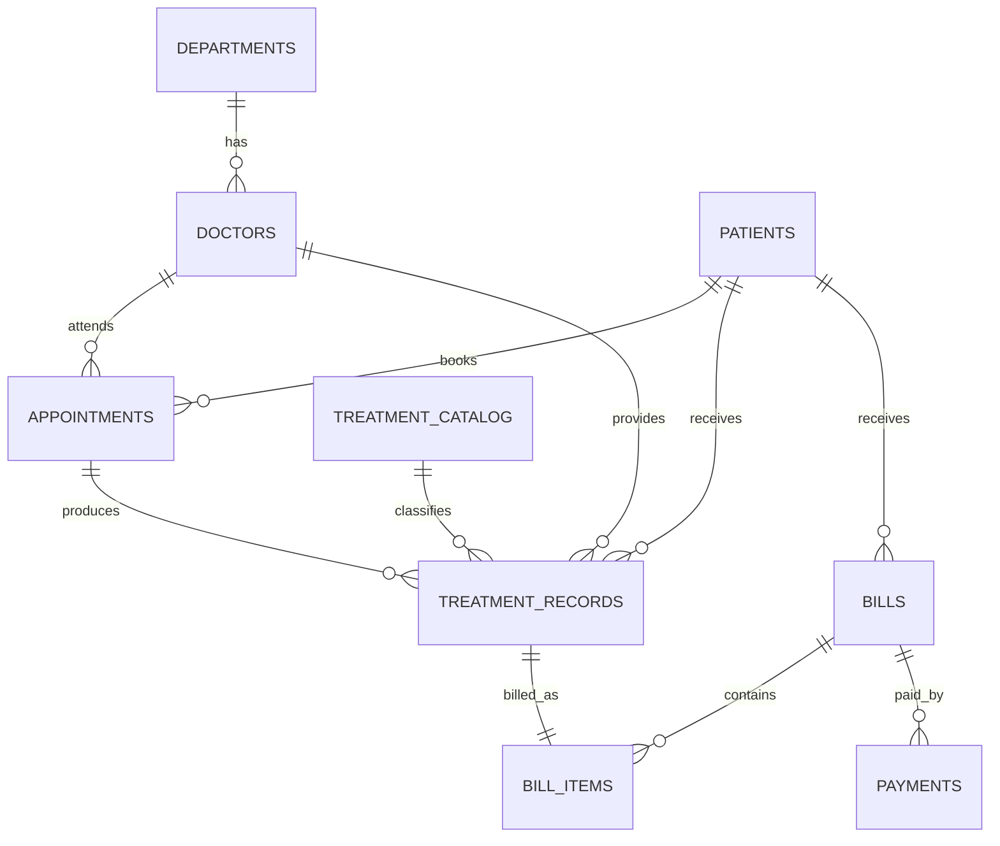

# Hospital Patient Management System

This is a full-stack Hospital Patient Management System with a React website, Node.js API, Prisma ORM, and a Supabase PostgreSQL-ready schema. It also includes the original Oracle SQL/PLSQL mini project for demonstrating procedures, functions, exception handling, and automatic billing.

## Files

- `client/` - React dashboard for patients, doctors, appointments, treatments, billing, payments, and analytics.
- `server/` - Node.js Express API used by the React app.
- `prisma/schema.prisma` - Supabase PostgreSQL data model managed through Prisma ORM.
- `prisma/seed.js` - seed data for Supabase PostgreSQL.
- `hospital_patient_management.sql` - Oracle SQL/PLSQL version with procedures, functions, exception handling, views, and a demo workflow.

## Run The React App

Install dependencies:

```bash
cd /Users/anindyamukhopadhyay/Developer/DBMS_PROJECT
npm install
```

Run locally:

```bash
cp .env.example .env
npm run dev
```

Open:

```text
http://127.0.0.1:5173
```

## Connect Supabase PostgreSQL

1. Create a Supabase project.
2. Open your project: `DBMS-Project`.
3. Project ID should be `pgylbxxslhzqalsraflv`.
4. Open **Connect** in Supabase and copy the PostgreSQL connection details.
5. Put the Shared Pooler URL in `.env` as `DATABASE_URL`.
6. Put the Direct connection URL in `.env` as `DIRECT_URL`.
7. Push the Prisma schema and seed data:

```bash
npm run db:generate
npm run db:push
npm run db:seed
npm run dev
```

## How To Run

Run the script in Oracle SQL Developer, SQL*Plus, or another Oracle client:

```sql
SET SERVEROUTPUT ON;
@hospital_patient_management.sql
```

The script drops old project objects, recreates the schema, inserts master data, runs a sample patient workflow, prints a bill with `DBMS_OUTPUT`, and records a payment.

## Main Tables

- `patients` stores patient demographics and emergency contact information.
- `doctors` stores doctor details, department, specialization, and consultation fee.
- `appointments` stores patient-doctor appointment bookings and appointment status.
- `treatment_catalog` stores available treatments and standard costs.
- `treatment_records` stores diagnosis, prescription, treatment code, quantity, and cost.
- `bills` stores generated bill totals, discounts, taxes, payment status, and paid amount.
- `bill_items` stores itemized treatment charges for each bill.
- `payments` stores payment history for bills.

## PL/SQL Components

### Procedures

- `pr_add_patient` adds a new patient after validating date of birth and gender.
- `pr_schedule_appointment` books an appointment and prevents duplicate doctor slots.
- `pr_record_treatment` records a treatment, completes the appointment, and automatically generates a bill.
- `pr_generate_bill` creates a bill from all unbilled treatment records for a patient.
- `pr_pay_bill` records full or partial bill payment.
- `pr_print_bill` prints an itemized bill using `DBMS_OUTPUT`.

### Functions

- `fn_patient_age(patient_id)` returns the patient's age.
- `fn_bill_total(bill_id)` recalculates the final bill total from bill items, discount, and tax.
- `fn_patient_balance(patient_id)` returns the patient's outstanding balance.

### Exception Handling

The procedures use application errors for common business failures:

- Missing patient, doctor, treatment code, or bill.
- Appointment scheduled in the past.
- Duplicate doctor appointment slot.
- Invalid gender, payment mode, quantity, discount, tax, or payment amount.
- Attempted payment greater than remaining bill balance.

## Automatic Billing Flow

1. Add a patient with `pr_add_patient`.
2. Schedule a visit with `pr_schedule_appointment`.
3. Record diagnosis and treatment with `pr_record_treatment`.
4. `pr_record_treatment` calls `pr_generate_bill` automatically.
5. The generated bill is itemized in `bill_items`.
6. Payment can be recorded with `pr_pay_bill`.

## Useful Queries

```sql
SELECT * FROM vw_patient_bill_summary;
SELECT * FROM vw_doctor_schedule ORDER BY appointment_at;
SELECT * FROM bills;
SELECT * FROM bill_items;
SELECT * FROM payments;
```

## Mini ER Diagram


