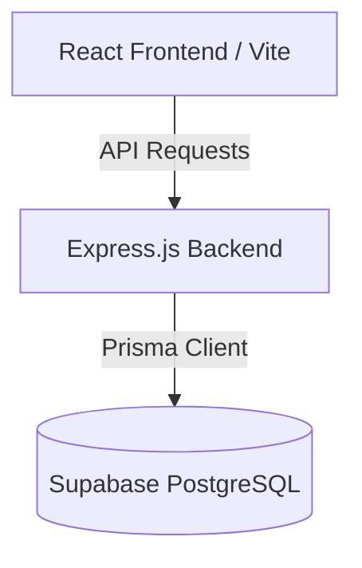

# TINT Care+ Hospital OS — System Documentation
*Created by Anindya*

TINT Care+ is a modern, responsive, full-stack Hospital Management and Electronic Medical Record (EMR) system. It uses a decoupled architecture linking a React client to an Express.js server, powered by Supabase PostgreSQL and Prisma ORM.

---

## 🏛️ System Architecture



### 1. Technology Stack
* **Frontend**: React 19, Vite, Recharts (analytics graphs), Lucide-React (vector iconography), and custom CSS variables theme system.
* **Backend**: Node.js, Express, CORS.
* **Database & ORM**: Supabase PostgreSQL with Prisma ORM for database migrations and type-safe query building.

---

## ⚙️ Configuration & Environment Variables

Create a `.env` file in the root directory to store database secrets:
```ini
# Supabase project details
SUPABASE_PROJECT_NAME="DBMS-Project"
SUPABASE_PROJECT_ID="pgylbxxslhzqalsraflv"
SUPABASE_REGION="ap-south-1"

# Database Connection Strings (Prisma format)
DATABASE_URL="postgresql://<user>:<password>@aws-1-ap-south-1.pooler.supabase.com:6543/postgres?sslmode=require&pgbouncer=true&schema=public"
DIRECT_URL="postgresql://<user>:<password>@db.pgylbxxslhzqalsraflv.supabase.co:5432/postgres?sslmode=require&schema=public"

# Node Express Port
PORT=4000
```

---

## 🚀 Running the Project Locally

1. **Install Root and Workspace Dependencies**:
   ```bash
   npm install
   ```

2. **Generate Database Client**:
   ```bash
   npx prisma generate
   ```

3. **Start Development Server**:
   ```bash
   npm run dev
   ```
   * **Frontend Client**: runs on `http://127.0.0.1:5173`
   * **Backend Server**: runs on watch-mode on `http://127.0.0.1:4000`

---

## 🔌 API Endpoints Documentation

### Core Endpoints

#### `GET /`
* **Description**: Returns health check and environment status.
* **Response**:
  ```json
  {
    "message": "TINT Care+ Hospital API is active and online.",
    "status": "healthy",
    "database": "Connected to Supabase PostgreSQL"
  }
  ```

#### `GET /api/bootstrap`
* **Description**: Fetches initial bootstrap database records (patients, doctors, appointments, treatment records, bills, payments).
* **Response**: A nested JSON object containing arrays for all records.

---

### Patient Directory

#### `POST /api/patients`
* **Description**: Registers a new patient.
* **Payload**:
  ```json
  {
    "fullName": "Jane Doe",
    "dateOfBirth": "1995-08-12",
    "gender": "FEMALE",
    "bloodGroup": "O+",
    "phone": "9876543210",
    "address": "12 Main St",
    "emergencyContact": "John Doe - 9876543211"
  }
  ```

---

### Specialist Directory

#### `POST /api/doctors`
* **Description**: Registers a new attending specialist.
* **Payload**:
  ```json
  {
    "fullName": "Dr. Sattyabrata Maity",
    "specialization": "Cardiologist",
    "phone": "9830098300",
    "departmentName": "Cardiology",
    "consultationFee": 800
  }
  ```

#### `PUT /api/doctors/:id`
* **Description**: Updates an existing doctor's profile.

#### `DELETE /api/doctors/:id`
* **Description**: Removes a doctor from the roster. (Fails safely if they have active EMR histories or appointments).

---

### Queue & Consultations

#### `POST /api/appointments`
* **Description**: Books an appointment slot for a patient.
* **Payload**:
  ```json
  {
    "patientId": 1,
    "doctorId": 2,
    "appointmentAt": "2026-07-20T10:30:00.000Z",
    "reason": "Routine Cardiology Consultation"
  }
  ```

#### `PATCH /api/appointments/:id/status`
* **Description**: Updates status (`SCHEDULED`, `COMPLETED`, `CANCELLED`).

#### `PATCH /api/appointments/:id/reschedule`
* **Description**: Reschedules the date/time of the appointment.

---

### Clinical EMR & Billing

#### `POST /api/treatments`
* **Description**: Records clinical EMR diagnosis, updates appointment status to `COMPLETED`, and generates the billing invoice.
* **Payload**:
  ```json
  {
    "appointmentId": 1,
    "treatmentCode": "CONSULT",
    "diagnosis": "Mild Hypertension",
    "prescription": "Amlodipine 5mg once daily",
    "discountPercent": 10
  }
  ```

#### `POST /api/payments`
* **Description**: Records a payment against a generated invoice.
* **Payload**:
  ```json
  {
    "billId": 1,
    "amount": 250.00,
    "paymentMode": "UPI",
    "referenceNo": "UPI/3192019201"
  }
  ```

---

## 🌐 Production Deployment

### 1. Backend API (Render)
* **Environment Configuration**: Set `DATABASE_URL` and `DIRECT_URL` environment variables in the Render console.
* **Build Command**: `npm install && npx prisma generate`
* **Start Command**: `node server/index.js`
* **Interface Binding**: Binds to host `0.0.0.0` for web routing.

### 2. Frontend Client (Vercel)
* **Import settings**: Import the GitHub repo and set Vite framework profile.
* **Root Directory**: Select `/client` folder as the root.
* **Dynamic Endpoint Routing**: Auto-switches to the production API `https://hospital-management-1q1d.onrender.com` when running in Vercel.
