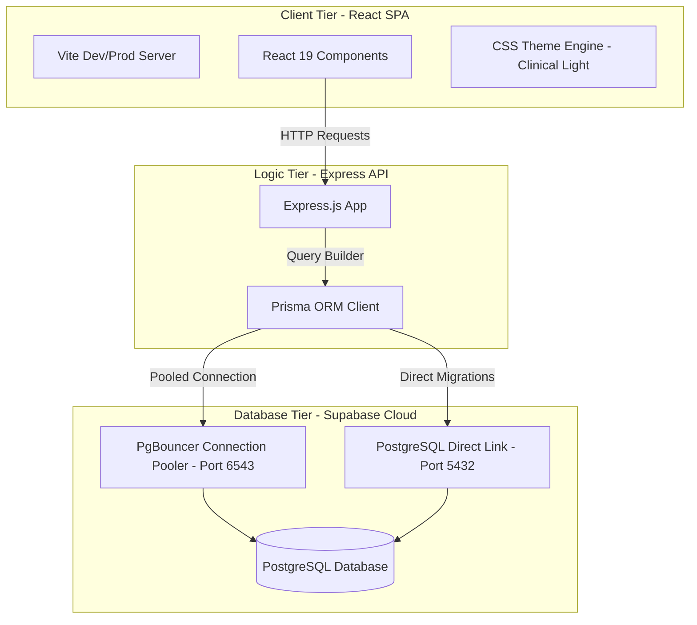
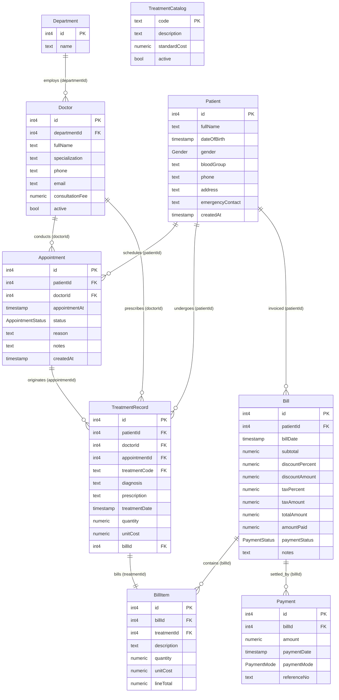
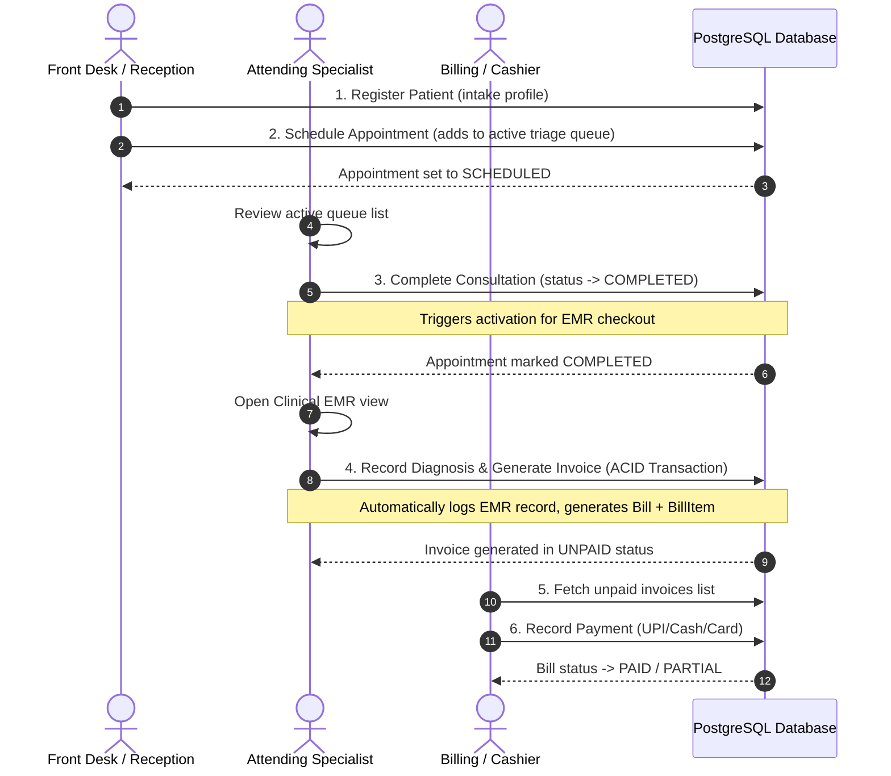

# 📔 DBMS Project Technical Report: TINT Care+ Hospital OS
*Created by Anindya • Academic DBMS Implementation Project*

---

## 1. Executive Summary & Project Introduction
**TINT Care+ Hospital OS** is an enterprise-grade, full-stack Hospital Management and Electronic Medical Record (EMR) system. The project is designed to solve real-world database management challenges in clinical environments—specifically synchronizing high-concurrency scheduling, atomic billing logs, precise financial calculations, and specialist roster audits.

The application leverages a decoupled Architecture:
* **Frontend**: React 19 single-page application built on Vite.
* **Backend**: Express.js REST API server.
* **Database Layer**: Remote Supabase PostgreSQL instance.
* **Object-Relational Mapping (ORM)**: Prisma Client.

---

## 2. DBMS System Architecture
The application runs on a three-tier system architecture with centralized state management on the client side, stateless request handling on the API side, and connection pooling on the database side.



---

## 3. Database Schema & ER Diagram (ERD)

The database schema defines nine tables with strict foreign key constraints, unique indices, and enumerations.

### Entity Relationship Diagram (ERD)
The following relational diagram represents the exact layout of the Supabase PostgreSQL database tables, columns, and cardinality constraints:



---

## 4. System Userflow Diagram
The clinical workflow maps the patient journey from admission through medical consultation, EMR filing, and financial clearance.



---

## 5. Core Database Mechanics & ACID Transactions

To ensure structural safety, the system implements **ACID (Atomicity, Consistency, Isolation, Durability)** transactions for clinical updates. 

### Atomic EMR & Bill Generation Flow
When a doctor files a clinical diagnosis:
1. A new `TreatmentRecord` is inserted.
2. The linked `Appointment` status is updated to `COMPLETED`.
3. A new `Bill` invoice is created, dynamically computing decimals for subtotals, discounts, and zero-tax rules.
4. A `BillItem` is logged pointing back to the treatment.

These operations are wrapped inside a single **Prisma Database Transaction block** (`prisma.$transaction`). If any single step fails, the entire transaction is rolled back, preventing orphaned records.

```javascript
return prisma.$transaction(async (tx) => {
  const appointment = await tx.appointment.findUnique({ where: { id: appointmentId } });
  
  // 1. Create Invoice Bill
  const bill = await tx.bill.create({
    data: { patientId, subtotal, discountPercent, totalAmount, amountPaid: 0 }
  });

  // 2. Insert EMR Treatment record
  const record = await tx.treatmentRecord.create({
    data: { patientId, doctorId, appointmentId, treatmentCode, diagnosis, billId: bill.id }
  });

  // 3. Link Invoice Line Item
  await tx.billItem.create({
    data: { billId: bill.id, treatmentId: record.id, lineTotal: subtotal }
  });

  // 4. Update Appointment Status
  await tx.appointment.update({
    where: { id: appointmentId },
    data: { status: "COMPLETED" }
  });
});
```

---

## 6. Key Engineering Fixes Implemented

### A. Strict Currency Precision (Paise Alignment)
* **Problem**: The frontend UI originally formatted currencies with `maximumFractionDigits: 0`, rounding a `₹2.50` balance up to `₹3.00`. When patients attempted to pay `3.00`, the backend correctly rejected the request because the actual due balance was only `2.50`.
* **Fix**: Configured the frontend `Intl.NumberFormat` to lock strictly to `minimumFractionDigits: 2` and `maximumFractionDigits: 2`, matching the database Decimal precision. Added `step="0.01"` and `min="0.01"` to the payment input to allow decimal payments.

### B. Network Interface Binding (0.0.0.0)
* **Problem**: The Express backend was hardcoded to listen on local loopback `127.0.0.1`, which caused Render's public network port-scanners to timeout during deployment.
* **Fix**: Updated host binding inside the listener function to `0.0.0.0` (all available interfaces), allowing Render's load balancers to route public traffic correctly.

---

## 7. Deployment Summary

### Backend (Render Web Service)
* **Build Command**: `npm install && npx prisma generate`
* **Start Command**: `node server/index.js`
* **Port Routing**: Environment port bindings auto-negotiated on `0.0.0.0:${PORT}`.

### Frontend (Vercel SPA)
* **Framework Preset**: Vite
* **Root Directory**: `client/`
* **Endpoint Fallback**: Automatically targets `https://hospital-management-1q1d.onrender.com` in production mode and local proxy routing in development.
