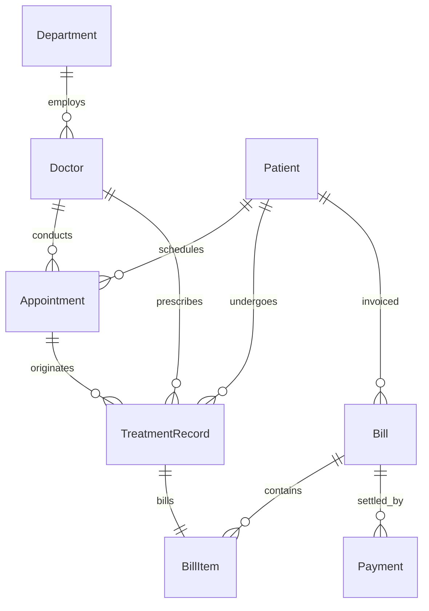

# 📝 DBMS Project Technical Report: TINT Care+ Hospital OS
*Created by Anindya • Academic DBMS Implementation Project*

---

## 1. Executive Summary & Project Introduction
**TINT Care+ Hospital OS** is an enterprise-grade, full-stack Hospital Management and Electronic Medical Record (EMR) system. The project is designed to solve real-world database management challenges in clinical environments—specifically synchronizing high-concurrency scheduling, atomic billing logs, precise financial precision, and specialist roster audits.

The application leverages a decoupled Architecture:
* **Frontend**: React 19 single-page application built on Vite.
* **Backend**: Express.js REST API server.
* **Database Layer**: Remote Supabase PostgreSQL instance.
* **Object-Relational Mapping (ORM)**: Prisma Client.

---

## 2. Database Schema & Relational Design
The database is structured to maintain strict relational integrity, utilizing cascading deletion rules, unique constraints, and numeric precision mapping.

### Entity Relationship Model (Relational Definitions)



### Table Schemas and Attributes

#### A. Patient (`Patient`)
*Tracks core clinical identities.*
* **`id`**: `Int` (Auto-incrementing Primary Key)
* **`fullName`**: `String`
* **`dateOfBirth`**: `DateTime`
* **`gender`**: `Enum (MALE, FEMALE, OTHER)`
* **`bloodGroup`**: `String` (Nullable)
* **`phone`**: `String`
* **`address`**: `String` (Nullable)
* **`emergencyContact`**: `String` (Nullable)

#### B. Doctor (`Doctor`)
*Tracks the medical specialist directory.*
* **`id`**: `Int` (Primary Key)
* **`fullName`**: `String`
* **`specialization`**: `String`
* **`phone`**: `String`
* **`consultationFee`**: `Decimal(10, 2)` (Defaults to 500.00)
* **`departmentId`**: `Int` (Foreign Key referencing `Department.id`)

#### C. Appointment (`Appointment`)
*Manages live triage slot booking. Implements a unique constraint to prevent double-booking.*
* **`id`**: `Int` (Primary Key)
* **`patientId`**: `Int` (Foreign Key referencing `Patient.id`)
* **`doctorId`**: `Int` (Foreign Key referencing `Doctor.id`)
* **`appointmentAt`**: `DateTime`
* **`status`**: `Enum (SCHEDULED, COMPLETED, CANCELLED)`
* **`reason`**: `String`
* **`Unique Constraint`**: `[doctorId, appointmentAt]` *(Ensures a doctor cannot be scheduled for two concurrent slots).*

#### D. Treatment Record & EMR (`TreatmentRecord`)
*Stores clinical diagnoses and prescriptions.*
* **`id`**: `Int` (Primary Key)
* **`patientId`**: `Int` (Foreign Key referencing `Patient.id`)
* **`doctorId`**: `Int` (Foreign Key referencing `Doctor.id`)
* **`appointmentId`**: `Int` (Nullable Foreign Key referencing `Appointment.id`)
* **`treatmentCode`**: `String` (Foreign Key referencing `TreatmentCatalog.code`)
* **`diagnosis`**: `String`
* **`prescription`**: `String` (Nullable)
* **`quantity`**: `Decimal(8, 2)` (Default `1.00`)
* **`unitCost`**: `Decimal(10, 2)`
* **`billId`**: `Int` (Nullable Foreign Key referencing `Bill.id`)

#### E. Billing & Invoices (`Bill`)
*Tracks patient financial logs.*
* **`id`**: `Int` (Primary Key)
* **`patientId`**: `Int` (Foreign Key referencing `Patient.id`)
* **`subtotal`**: `Decimal(10, 2)`
* **`discountPercent`**: `Decimal(5, 2)` (Defaults to 0.00%)
* **`taxPercent`**: `Decimal(5, 2)` (Defaults to 0.00% standard clinical tax)
* **`totalAmount`**: `Decimal(10, 2)`
* **`amountPaid`**: `Decimal(10, 2)`
* **`paymentStatus`**: `Enum (UNPAID, PARTIAL, PAID)`

#### F. Payments (`Payment`)
*Records historical payment transactions.*
* **`id`**: `Int` (Primary Key)
* **`billId`**: `Int` (Foreign Key referencing `Bill.id`)
* **`amount`**: `Decimal(10, 2)`
* **`paymentMode`**: `Enum (CASH, CARD, UPI, INSURANCE)`
* **`referenceNo`**: `String` (Nullable)
* **`paymentDate`**: `DateTime` (Defaults to current timestamp)

---

## 3. Core Database Mechanics & ACID Transactions

To ensure structural safety, the system implements **ACID (Atomicity, Consistency, Isolation, Durability)** transactions for clinical updates. 

### Atomic EMR & Bill Generation Flow
When a doctor files a clinical diagnosis:
1. A new `TreatmentRecord` is inserted.
2. The linked `Appointment` status is updated to `COMPLETED`.
3. A new `Bill` invoice is created, dynamically computing decimals for subtotals, discounts, and zero-tax rules.
4. A `BillItem` is logged pointing back to the treatment.

These operations are wrapped inside a single **Prisma Database Transaction block** (`prisma.$transaction`). If any single step fails, the entire transaction is rolled back, preventing orphaned records.

```javascript
return prisma.$transaction(async (tx) => {
  const appointment = await tx.appointment.findUnique({ where: { id: appointmentId } });
  
  // 1. Create Invoice Bill
  const bill = await tx.bill.create({
    data: { patientId, subtotal, discountPercent, totalAmount, amountPaid: 0 }
  });

  // 2. Insert EMR Treatment record
  const record = await tx.treatmentRecord.create({
    data: { patientId, doctorId, appointmentId, treatmentCode, diagnosis, billId: bill.id }
  });

  // 3. Link Invoice Line Item
  await tx.billItem.create({
    data: { billId: bill.id, treatmentId: record.id, lineTotal: subtotal }
  });

  // 4. Update Appointment Status
  await tx.appointment.update({
    where: { id: appointmentId },
    data: { status: "COMPLETED" }
  });
});
```

---

## 4. Key Engineering Fixes Implemented

### A. Strict Currency Precision (Paise Alignment)
* **Problem**: The frontend UI originally formatted currencies with `maximumFractionDigits: 0`, rounding a `₹2.50` balance up to `₹3.00`. When patients attempted to pay `3.00`, the backend correctly rejected the request because the actual due balance was only `2.50`.
* **Fix**: Configured the frontend `Intl.NumberFormat` to lock strictly to `minimumFractionDigits: 2` and `maximumFractionDigits: 2`, matching the database Decimal precision. Added `step="0.01"` and `min="0.01"` to the payment input to allow decimal payments.

### B. Network Interface Binding (0.0.0.0)
* **Problem**: The Express backend was hardcoded to listen on local loopback `127.0.0.1`, which caused Render's public network port-scanners to timeout during deployment.
* **Fix**: Updated host binding inside the listener function to `0.0.0.0` (all available interfaces), allowing Render's load balancers to route public traffic correctly.

---

## 5. Deployment Guide

### Backend (Render Web Service)
* **Build Command**: `npm install && npx prisma generate`
* **Start Command**: `node server/index.js`
* **Port Routing**: Environment port bindings auto-negotiated on `0.0.0.0:${PORT}`.

### Frontend (Vercel SPA)
* **Framework Preset**: Vite
* **Root Directory**: `client/`
* **Endpoint Fallback**: Automatically targets `https://hospital-management-1q1d.onrender.com` in production mode and local proxy routing in development.
