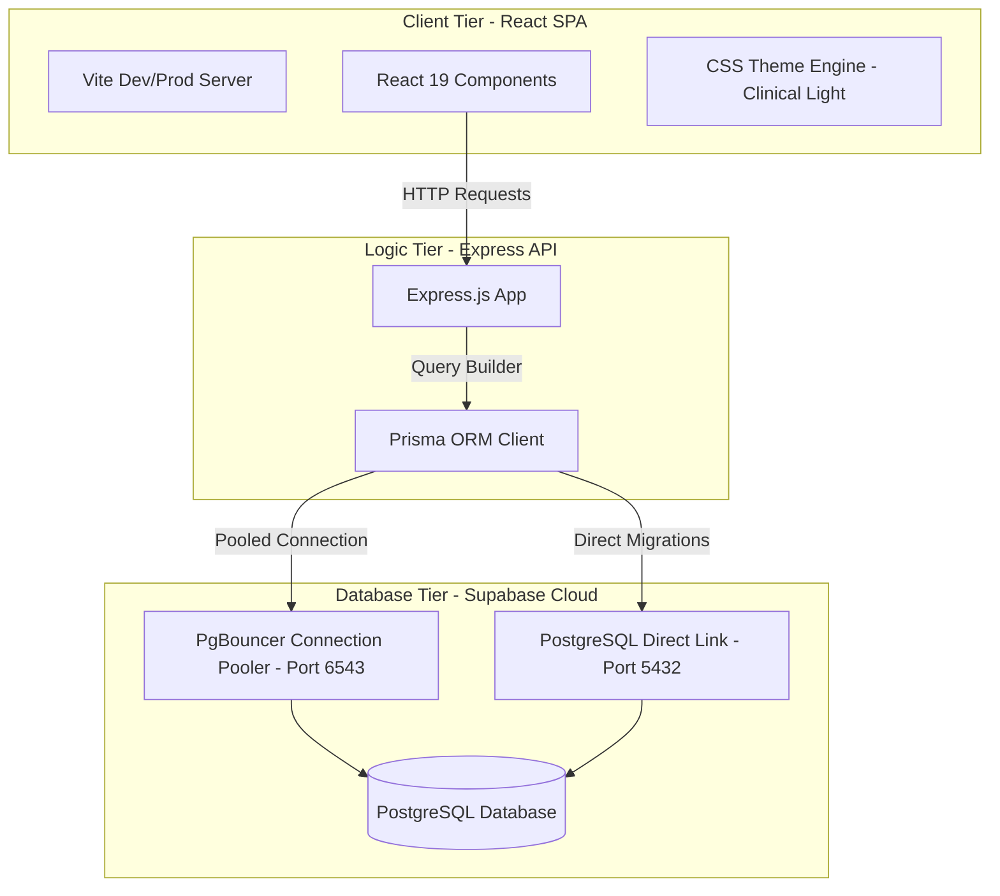
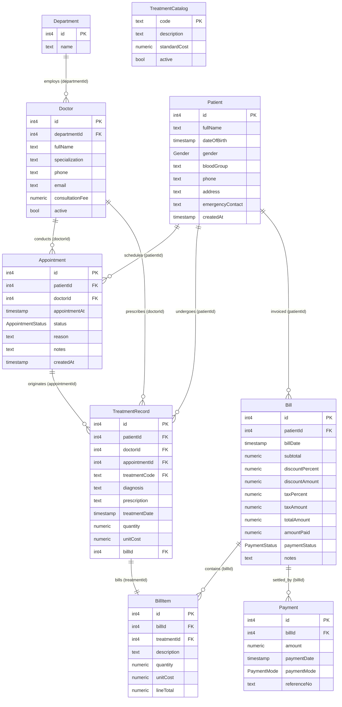
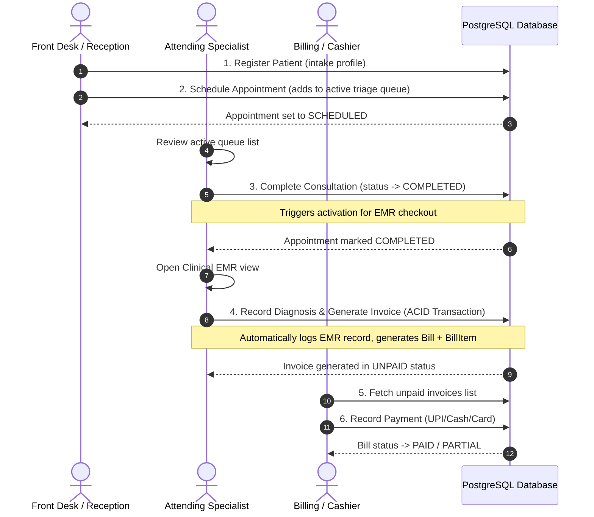

# 📔 DBMS Project Technical Report & Database Schema Manual
*Created by Anindya • Academic DBMS Implementation Project*

---

## 1. Executive Summary & Project Introduction
**TINT Care+ Hospital OS** is an enterprise-grade, full-stack Hospital Management and Electronic Medical Record (EMR) system. The project is designed to solve real-world database management challenges in clinical environments—specifically synchronizing high-concurrency scheduling, atomic billing logs, precise financial calculations, and specialist roster audits.

The application leverages a decoupled Architecture:
* **Frontend**: React 19 single-page application built on Vite.
* **Backend**: Express.js REST API server.
* **Database Layer**: Remote Supabase PostgreSQL instance.
* **Object-Relational Mapping (ORM)**: Prisma Client.

---

## 2. DBMS System Architecture
The application runs on a three-tier system architecture with centralized state management on the client side, stateless request handling on the API side, and connection pooling on the database side.



---

## 3. Database Schema & ER Diagram (ERD)

The database schema defines nine tables with strict foreign key constraints, unique indices, and enumerations.

### Entity Relationship Diagram (ERD)
The following relational diagram represents the exact layout of the Supabase PostgreSQL database tables, columns, and cardinality constraints:



---

## 4. System Userflow Diagram
The clinical workflow maps the patient journey from admission through medical consultation, EMR filing, and financial clearance.



---

## 5. DDL Schema Definition (Manual SQL Create Tables)

Run these queries in sequence to create the database types, tables, constraints, and relationships manually in your **Supabase SQL Editor** or any PostgreSQL CLI.

### A. Define Enumerations (Custom Types)
```sql
CREATE TYPE "Gender" AS ENUM ('MALE', 'FEMALE', 'OTHER');
CREATE TYPE "AppointmentStatus" AS ENUM ('SCHEDULED', 'COMPLETED', 'CANCELLED');
CREATE TYPE "PaymentStatus" AS ENUM ('UNPAID', 'PARTIAL', 'PAID');
CREATE TYPE "PaymentMode" AS ENUM ('CASH', 'CARD', 'UPI', 'INSURANCE');
```

### B. Create Tables & Constraints
```sql
-- 1. Department
CREATE TABLE "Department" (
    "id" SERIAL PRIMARY KEY,
    "name" TEXT NOT NULL UNIQUE
);

-- 2. Patient
CREATE TABLE "Patient" (
    "id" SERIAL PRIMARY KEY,
    "fullName" TEXT NOT NULL,
    "dateOfBirth" TIMESTAMP(3) NOT NULL,
    "gender" "Gender" NOT NULL,
    "bloodGroup" TEXT,
    "phone" TEXT NOT NULL,
    "address" TEXT,
    "emergencyContact" TEXT,
    "createdAt" TIMESTAMP(3) NOT NULL DEFAULT CURRENT_TIMESTAMP
);

-- 3. Doctor
CREATE TABLE "Doctor" (
    "id" SERIAL PRIMARY KEY,
    "departmentId" INTEGER NOT NULL REFERENCES "Department"("id") ON DELETE RESTRICT ON UPDATE CASCADE,
    "fullName" TEXT NOT NULL,
    "specialization" TEXT NOT NULL,
    "phone" TEXT NOT NULL,
    "email" TEXT,
    "consultationFee" DECIMAL(10,2) NOT NULL DEFAULT 0.00,
    "active" BOOLEAN NOT NULL DEFAULT TRUE
);

-- 4. Treatment Catalog
CREATE TABLE "TreatmentCatalog" (
    "code" TEXT PRIMARY KEY,
    "description" TEXT NOT NULL,
    "standardCost" DECIMAL(10,2) NOT NULL,
    "active" BOOLEAN NOT NULL DEFAULT TRUE
);

-- 5. Appointment
CREATE TABLE "Appointment" (
    "id" SERIAL PRIMARY KEY,
    "patientId" INTEGER NOT NULL REFERENCES "Patient"("id") ON DELETE RESTRICT ON UPDATE CASCADE,
    "doctorId" INTEGER NOT NULL REFERENCES "Doctor"("id") ON DELETE RESTRICT ON UPDATE CASCADE,
    "appointmentAt" TIMESTAMP(3) NOT NULL,
    "status" "AppointmentStatus" NOT NULL DEFAULT 'SCHEDULED',
    "reason" TEXT NOT NULL,
    "notes" TEXT,
    "createdAt" TIMESTAMP(3) NOT NULL DEFAULT CURRENT_TIMESTAMP,
    CONSTRAINT "uq_doctor_appointment_time" UNIQUE ("doctorId", "appointmentAt")
);

-- 6. Bill (Invoices)
CREATE TABLE "Bill" (
    "id" SERIAL PRIMARY KEY,
    "patientId" INTEGER NOT NULL REFERENCES "Patient"("id") ON DELETE RESTRICT ON UPDATE CASCADE,
    "billDate" TIMESTAMP(3) NOT NULL DEFAULT CURRENT_TIMESTAMP,
    "subtotal" DECIMAL(10,2) NOT NULL DEFAULT 0.00,
    "discountPercent" DECIMAL(5,2) NOT NULL DEFAULT 0.00,
    "discountAmount" DECIMAL(10,2) NOT NULL DEFAULT 0.00,
    "taxPercent" DECIMAL(5,2) NOT NULL DEFAULT 0.00,
    "taxAmount" DECIMAL(10,2) NOT NULL DEFAULT 0.00,
    "totalAmount" DECIMAL(10,2) NOT NULL DEFAULT 0.00,
    "amountPaid" DECIMAL(10,2) NOT NULL DEFAULT 0.00,
    "paymentStatus" "PaymentStatus" NOT NULL DEFAULT 'UNPAID',
    "notes" TEXT
);

-- 7. Treatment Record (EMR Dossier)
CREATE TABLE "TreatmentRecord" (
    "id" SERIAL PRIMARY KEY,
    "patientId" INTEGER NOT NULL REFERENCES "Patient"("id") ON DELETE RESTRICT ON UPDATE CASCADE,
    "doctorId" INTEGER NOT NULL REFERENCES "Doctor"("id") ON DELETE RESTRICT ON UPDATE CASCADE,
    "appointmentId" INTEGER REFERENCES "Appointment"("id") ON DELETE SET NULL ON UPDATE CASCADE,
    "treatmentCode" TEXT NOT NULL REFERENCES "TreatmentCatalog"("code") ON DELETE RESTRICT ON UPDATE CASCADE,
    "diagnosis" TEXT NOT NULL,
    "prescription" TEXT,
    "treatmentDate" TIMESTAMP(3) NOT NULL DEFAULT CURRENT_TIMESTAMP,
    "quantity" DECIMAL(8,2) NOT NULL DEFAULT 1.00,
    "unitCost" DECIMAL(10,2) NOT NULL,
    "billId" INTEGER REFERENCES "Bill"("id") ON DELETE SET NULL ON UPDATE CASCADE
);

-- 8. Bill Item (Invoice Line Details)
CREATE TABLE "BillItem" (
    "id" SERIAL PRIMARY KEY,
    "billId" INTEGER NOT NULL REFERENCES "Bill"("id") ON DELETE CASCADE ON UPDATE CASCADE,
    "treatmentId" INTEGER NOT NULL UNIQUE REFERENCES "TreatmentRecord"("id") ON DELETE RESTRICT ON UPDATE CASCADE,
    "description" TEXT NOT NULL,
    "quantity" DECIMAL(8,2) NOT NULL,
    "unitCost" DECIMAL(10,2) NOT NULL,
    "lineTotal" DECIMAL(10,2) NOT NULL
);

-- 9. Payment
CREATE TABLE "Payment" (
    "id" SERIAL PRIMARY KEY,
    "billId" INTEGER NOT NULL REFERENCES "Bill"("id") ON DELETE RESTRICT ON UPDATE CASCADE,
    "amount" DECIMAL(10,2) NOT NULL,
    "paymentDate" TIMESTAMP(3) NOT NULL DEFAULT CURRENT_TIMESTAMP,
    "paymentMode" "PaymentMode" NOT NULL,
    "referenceNo" TEXT
);
```

---

## 6. DML Seed Data (Insert Initial Specialists & Catalog)

Run these queries to populate departments, treatments, and specialists:

```sql
-- 1. Seed Departments
INSERT INTO "Department" ("id", "name") VALUES 
(1, 'Cardiology'),
(2, 'Orthopedics'),
(3, 'General Medicine')
ON CONFLICT ("id") DO UPDATE SET "name" = EXCLUDED."name";

-- 2. Seed Attending Specialists
INSERT INTO "Doctor" ("id", "departmentId", "fullName", "specialization", "phone", "email", "consultationFee", "active") VALUES
(1, 1, 'Dr. Sattyabrata Maity', 'Cardiologist', '9830098300', 'maity.cardio@tintcare.example', 800.00, true),
(2, 2, 'Dr. Arijit Tiwari', 'Orthopedic Surgeon', '9830198301', 'tiwari.ortho@tintcare.example', 700.00, true),
(3, 3, 'Dr. Sourav Mahapatra', 'General Physician', '9830298302', 'mahapatra.gp@tintcare.example', 500.00, true)
ON CONFLICT ("id") DO UPDATE SET 
  "fullName" = EXCLUDED."fullName",
  "specialization" = EXCLUDED."specialization",
  "consultationFee" = EXCLUDED."consultationFee";

-- 3. Seed Clinical Treatment Catalog
INSERT INTO "TreatmentCatalog" ("code", "description", "standardCost", "active") VALUES
('CONSULT', 'Doctor Consultation', 500.00, true),
('ECG', 'Electrocardiogram Scan', 1200.00, true),
('XRAY', 'X-Ray Chest Scan', 900.00, true),
('BLOOD', 'Blood Test Panel', 650.00, true),
('PHYSIO', 'Physiotherapy Session', 1100.00, true)
ON CONFLICT ("code") DO UPDATE SET 
  "description" = EXCLUDED."description",
  "standardCost" = EXCLUDED."standardCost";
```

---

## 7. Operations DML (CRUD Query Library)

### A. Patient Intake (Create Patient)
```sql
INSERT INTO "Patient" ("fullName", "dateOfBirth", "gender", "bloodGroup", "phone", "address", "emergencyContact")
VALUES ('Arijit Karmakar', '2003-12-12 20:47:00', 'MALE', 'B+', '9876543212', 'Salt Lake Sector 3, Kolkata', 'Rita Karmakar - 9876543213');
```

### B. Booking Consultation (Create Appointment)
```sql
INSERT INTO "Appointment" ("patientId", "doctorId", "appointmentAt", "status", "reason")
VALUES (1, 2, '2026-07-25 15:30:00', 'SCHEDULED', 'Severe back pain & posture fatigue');
```

### C. Rescheduling Appointment (Update Date/Time)
```sql
UPDATE "Appointment"
SET "appointmentAt" = '2026-07-26 11:15:00'
WHERE "id" = 1;
```

### D. Completing Consultation Triage (Update Status)
```sql
UPDATE "Appointment"
SET "status" = 'COMPLETED'
WHERE "id" = 1;
```

### E. Recording EMR Diagnosis & Billing (Transactional Action)
*Wraps EMR filing, Invoice generation, and Invoice line item creation.*
```sql
-- 1. Create the Bill (Subtotal: 700.00, Discount: 50%, Tax: 0%, Total: 350.00)
INSERT INTO "Bill" ("patientId", "subtotal", "discountPercent", "discountAmount", "taxPercent", "taxAmount", "totalAmount", "amountPaid", "paymentStatus", "notes")
VALUES (1, 700.00, 50.00, 350.00, 0.00, 0.00, 350.00, 0.00, 'UNPAID', 'EMR Auto-generated invoice')
RETURNING "id"; -- Assume ID returned is '1'

-- 2. Insert EMR record
INSERT INTO "TreatmentRecord" ("patientId", "doctorId", "appointmentId", "treatmentCode", "diagnosis", "prescription", "quantity", "unitCost", "billId")
VALUES (1, 2, 1, 'CONSULT', 'Lumbar strain due to ergonomics', 'Physiotherapy 3 sessions, Ibuprofen 400mg', 1.00, 700.00, 1)
RETURNING "id"; -- Assume ID returned is '1'

-- 3. Insert Invoice Detail
INSERT INTO "BillItem" ("billId", "treatmentId", "description", "quantity", "unitCost", "lineTotal")
VALUES (1, 1, 'Orthopedic Specialist Consultation', 1.00, 700.00, 700.00);
```

### F. Processing Payment (Create Payment & Update Bill Status)
*UPI Payment of exact remaining balance of 350.00.*
```sql
-- 1. Record the Payment
INSERT INTO "Payment" ("billId", "amount", "paymentMode", "referenceNo")
VALUES (1, 350.00, 'UPI', 'UPI/7382901823');

-- 2. Update Bill payment status to PAID
UPDATE "Bill"
SET "amountPaid" = 350.00,
    "paymentStatus" = 'PAID'
WHERE "id" = 1;
```

### G. Deleting a Specialist safely
*Fails safely if there are dependent records, otherwise removes them.*
```sql
-- Deleting Doctor ID 2 will throw a foreign-key error if they have appointments:
-- "violates foreign key constraint on table Appointment"
DELETE FROM "Doctor" WHERE "id" = 2;
```

---

## 8. Core Application Mechanics & ACID Transactions

To ensure structural safety, the system implements **ACID (Atomicity, Consistency, Isolation, Durability)** transactions for clinical updates. 

### Atomic EMR & Bill Generation Flow
When a doctor files a clinical diagnosis:
1. A new `TreatmentRecord` is inserted.
2. The linked `Appointment` status is updated to `COMPLETED`.
3. A new `Bill` invoice is created, dynamically computing decimals for subtotals, discounts, and zero-tax rules.
4. A `BillItem` is logged pointing back to the treatment.

These operations are wrapped inside a single **Prisma Database Transaction block** (`prisma.$transaction`). If any single step fails, the entire transaction is rolled back, preventing orphaned records.

```javascript
return prisma.$transaction(async (tx) => {
  const appointment = await tx.appointment.findUnique({ where: { id: appointmentId } });
  
  // 1. Create Invoice Bill
  const bill = await tx.bill.create({
    data: { patientId, subtotal, discountPercent, totalAmount, amountPaid: 0 }
  });

  // 2. Insert EMR Treatment record
  const record = await tx.treatmentRecord.create({
    data: { patientId, doctorId, appointmentId, treatmentCode, diagnosis, billId: bill.id }
  });

  // 3. Link Invoice Line Item
  await tx.billItem.create({
    data: { billId: bill.id, treatmentId: record.id, lineTotal: subtotal }
  });

  // 4. Update Appointment Status
  await tx.appointment.update({
    where: { id: appointmentId },
    data: { status: "COMPLETED" }
  });
});
```

---

## 9. Key Engineering Fixes Implemented

### A. Strict Currency Precision (Paise Alignment)
* **Problem**: The frontend UI originally formatted currencies with `maximumFractionDigits: 0`, rounding a `₹2.50` balance up to `₹3.00`. When patients attempted to pay `3.00`, the backend correctly rejected the request because the actual due balance was only `2.50`.
* **Fix**: Configured the frontend `Intl.NumberFormat` to lock strictly to `minimumFractionDigits: 2` and `maximumFractionDigits: 2`, matching the database Decimal precision. Added `step="0.01"` and `min="0.01"` to the payment input to allow decimal payments.

### B. Network Interface Binding (0.0.0.0)
* **Problem**: The Express backend was hardcoded to listen on local loopback `127.0.0.1`, which caused Render's public network port-scanners to timeout during deployment.
* **Fix**: Updated host binding inside the listener function to `0.0.0.0` (all available interfaces), allowing Render's load balancers to route public traffic correctly.

---

## 10. Deployment Summary

### Backend (Render Web Service)
* **Build Command**: `npm install && npx prisma generate`
* **Start Command**: `node server/index.js`
* **Port Routing**: Environment port bindings auto-negotiated on `0.0.0.0:${PORT}`.

### Frontend (Vercel SPA)
* **Framework Preset**: Vite
* **Root Directory**: `client/`
* **Endpoint Fallback**: Automatically targets `https://hospital-management-1q1d.onrender.com` in production mode and local proxy routing in development.
